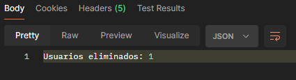
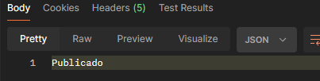

# Bot Social Media

Este es un repositorio open source el cual permite en su version V1.0 hacer publicaciones periodicamente (automatico) en la plataforma de instagram al igual que dejar de seguir usuarios que no te siguen 
# Tabla de contenido
* [Contribuidores](#contributors)
* [Tecnologias de la aplicación](#application-architecture)
* [Guia de instalación](#using-application)
    * [Correr en local](#run_local_mc)
* [Uso de enpoints](#using-endpoints)
* [Librerias (Gradle)](#libraries)


## <a name="contributors"></a>Contribuidores

* [Manuel Bedoya](https://www.linkedin.com/in/manu-bedoya/)

## <a name="application-architecture"></a>Tecnologias de la aplicación

La aplicación maneja las siguientes herramientas, librerias, y tecnologia relevantes para su funcionamiento

* [SPRINGBOOT](config-server/README.md) - Framework
* [FIREBASE](webservice-registry/README.md) - Como Base de datos para imagenes
* [GOOGLESHEETS](auth-server/README.md) - Aca está la información de lo que se publicará y cuando se publica
* [com.github.instagram4j](user-webservice/README.md) - libreria open source para la conexión a instagram


## <a name="using-application"></a>Guía de instalación

### <a name="run_local_mc"></a>Correr en local

* git clone https://github.com/ManuBedoya/botSocialMedia.git
* cd botSocialMedia/
* ./gradlew bootRun

### **Notas:**
* Debe crear una hoja de calculo en google sheets
* Debe crear una aplicación en googleSheets para configurarla en el proyecto,link guia https://developers.google.com/sheets/api/quickstart/java?hl=es-419
* Debe crear storage en FIREBASE y configurarlo en el proyecto, link guia https://www.baeldung.com/spring-fcm
* Debe tener las siguientes variables de entorno para funcionamiento del proyecto : 
  * USERNAMEIG=<nombre_de_usuario_instagram>
  * PASSWORDIG=<contraseña_instagram>
  * GMAILACCOUNT=<correo_con_el_que_creo_aplicacion_google_sheet>
  * BUCKETFIREBASE=<direccion_del_bucket_firebase> (sin el gs://)
  * SPREADSHEETS=<ID_Hoja_de_calculo_creada>

## <a name="using-endpoints"></a> Uso de endpoints
### Dejar de seguir usuarios que no me siguen
**Endpoint:**  http://localhost:8080/botSocialMedia/v1/instagram/unfollow

**Descripción:** Deja de seguir a usuarios que no te siguen exceptuando a los usuarios que mandes en el body

**Method:** POST

**Body:** lo podemos dejar vacio o agregar las cuentas que no queremos dejar de seguir
```

{
    "exceptionCounts" : ["username1", "username2", "username3"....]
}

```
**Respuesta:**


---
**Endpoint:**  http://localhost:8080/botSocialMedia/v1/instagram/publish-now

**Descripción:** Publica al instante en el feed de instagram

**Method:** POST

**Body:**
```

{
    "description": "<descripcion_del_post>",
    "imageUrl": "<nombre_de_la_imagen_en_firebase>.jpg"
}

```
**Respuesta:**



----


## <a name="libraries"></a>Librerias usadas en el proyecto (Gradle)
```
	implementation 'org.springframework.boot:spring-boot-starter-web'
	compileOnly 'org.projectlombok:lombok'
	developmentOnly 'org.springframework.boot:spring-boot-devtools'
	annotationProcessor 'org.projectlombok:lombok'
	testImplementation 'org.springframework.boot:spring-boot-starter-test'
	implementation 'com.google.api-client:google-api-client:2.0.0'
	implementation 'com.google.oauth-client:google-oauth-client-jetty:1.34.1'
	implementation 'com.google.apis:google-api-services-sheets:v4-rev20220927-2.0.0'
	implementation 'com.github.instagram4j:instagram4j:2.0.7'
	implementation 'com.github.instagram4j:instagram4j:master-SNAPSHOT'
	implementation group: 'com.fasterxml.jackson.core', name: 'jackson-databind', version: '2.16.1'
	implementation group: 'com.fasterxml.jackson.core', name: 'jackson-annotations', version: '2.16.1'
	implementation group: 'org.slf4j', name: 'slf4j-api', version: '2.0.11'
	implementation group: 'commons-codec', name: 'commons-codec', version: '1.15'
	implementation group: 'org.json', name: 'json', version: '20231013'
	implementation 'com.google.firebase:firebase-admin:9.2.0'
```
